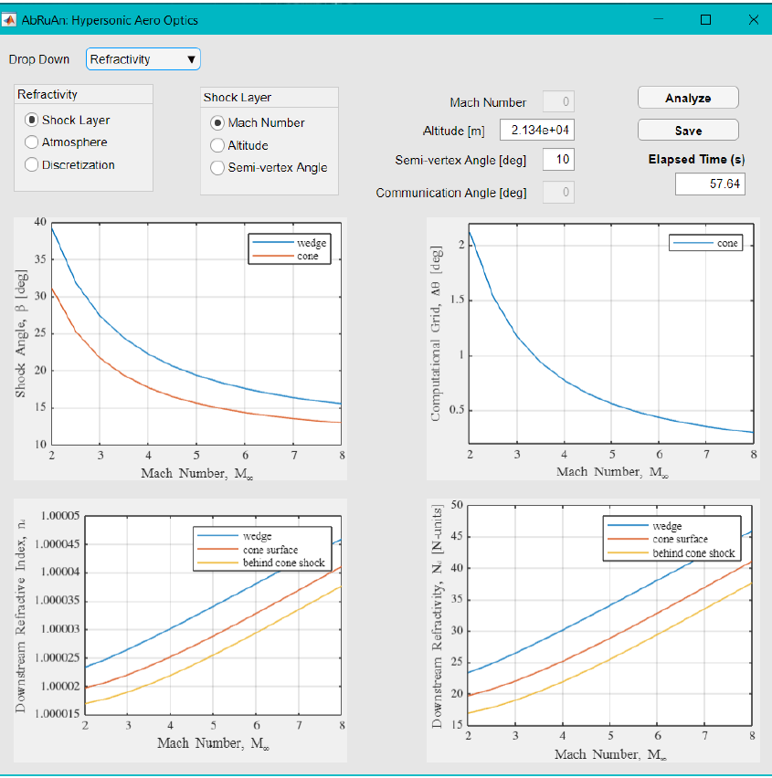

.. _aboutAbruan:

AbRuAn: Hypersonic Aero-Optics Simulation Framework
==============================================================

.. sidebar:: AbRuAn Vision

   .. image:: _images/banner1.png
       :align: center
       :width: 300

   **Description:** A simulation framework for aero and plasma optics analysis in high-speed and planetary environment. 
   
   **License:** MIT License (Not Finalized)

   **Platforms:** macOS, Linux and Windows
   
   **First Release:** Jun 2020

   **Status:** In development

What is AbRuAn?
------------------
AbRuAn (or abruan) is named after my family members - Abhinav, Ruchi, and Anil Kumar Gupta. It is an aero-optical simulation framework developed at the University of Colorado Boulder for the analysis of aero-optics in high-speed flows. The package is restricted from wide public distribution but may be requested by an individual or group or organization.

Architecture
-------------
**First Architecture:** Abruan was first developed in MATLAB with GUI created using the App Designer. It was packaged as a standalone application which required downloading MATLAB Runtime (MCR) at the first instance of use if MATLAB is not installed on the host computer. The first release was in 2020. 

**Revised Architecture:** The re-architecture of AbRuAn is aimed at faster execution, flexibility of reconfiguration, multi-species modeling in planetary atmospheres, and Monte Carlo analysis. Frames and domains form the basis of this framework. Flowfield, if comupted using external solver, can be read and used for aero-optics.

Relevant Publications
----------------------
- Gupta, A.; "`Analytical Theory of Aero-Optical and Atmospheric Effects in Supersonic and Hypersonic Flows. <https://scholar.colorado.edu/concern/graduate_thesis_or_dissertations/mg74qn20w>`_” Master’s thesis, the University of Colorado at Boulder, 2020.

- Gupta, A.; Ripoll, P. M.; Campbell, N. S.;  and Argrow, B.; "`Assessment of Optical Propagation Models with Application to Hypersonic Entry. <https://arc.aiaa.org/doi/10.2514/6.2023-0817>`_" In AIAA SciTech, National Harbor, Maryland, Jan. 23 - 28, 2023. doi: 10.2514/6.2023-0817

- Gupta, A.; and Argrow, B.; "`Analytical Approach for Aero-Optical and Atmospheric Effects in Supersonic Flow Fields. <https://arc.aiaa.org/doi/10.2514/6.2020-0684>`_" In AIAA SciTech, Orlando, Florida, Jan. 6 - 10, 2020. doi: 10.2514/6.2020-0684

.. toctree::
   :hidden:
   :maxdepth: 1
   :caption: AbRuAn:

   rst/install
   rst/example

.. Indices and tables
.. ==================

.. * :ref:`genindex`
.. * :ref:`modindex`
.. * :ref:`search`
